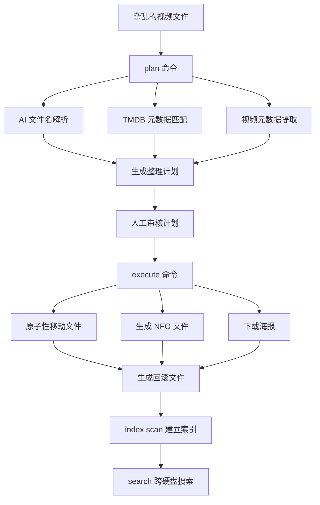

# Media Organizer 完整用户手册

版本 1.0 | 最后更新: 2026年4月

---

## 目录

1. [📖 项目概述](#1-项目概述)
2. [⚙️ 安装配置](#2-安装配置)
3. [📜 命令参考](#3-命令参考)
4. [🔄 工作流程](#4-工作流程)
5. [🗄️ 中央索引系统](#5-中央索引系统)
6. [🔍 搜索功能](#6-搜索功能)
7. [💾 备份与恢复](#7-备份与恢复)
8. [🛠️ 高级特性](#8-高级特性)
9. [❓ 常见问题](#9-常见问题)
10. [📋 最佳实践](#10-最佳实践)

---

## 1. 项目概述

**Media Organizer** 是专为大规模媒体收藏设计的高性能整理工具，使用 Rust 编写，保证极致的性能与数据安全。

### ✨ 核心特性

| 功能 | 描述 |
|------|------|
| 🤖 **本地 AI 解析** | *可选高级功能* 基于 Ollama 运行 7B 大语言模型，可解析任意格式的中英文文件名。**默认不启用，默认使用本地正则解析引擎**。 |
| 🎬 **TMDB 元数据** | 自动匹配全球最大影视数据库，获取完整元数据、海报、演职员表 |
| 📁 **标准化命名** | 统一命名规则，完美兼容 Kodi / Emby / Jellyfin 等媒体服务器 |
| 📄 **NFO 生成** | 自动生成标准 NFO 元数据文件 |
| 🖼️ **海报下载** | 自动下载高清海报与背景图 |
| 🗄️ **中央索引** | 跨多硬盘统一索引，离线状态下也可搜索整个收藏 |
| 🔄 **事务执行** | 所有操作支持完整回滚，永不丢失数据 |
| 🚀 **极致性能** | 单进程每秒处理超过 1000 个文件，支持百万级媒体库 |

### 🎯 支持媒体类型

| 类型 | 支持状态 |
|------|----------|
| 电影 | ✅ 完全支持 |
| 电视剧 | ✅ 完全支持 |
| 纪录片 | ✅ 自动识别 |
| 动画 | ✅ 自动识别 |

---

## 2. 安装配置

### 2.1 系统要求

| 配置 | 最低 | 推荐 |
|------|------|------|
| 操作系统 | Linux 5.10+ | 最新 LTS 发行版 |
| 内存 | 8 GB | 16 GB+ |
| CPU | 4 核心 | 8 核心以上 |
| 存储 | 10 GB 空闲 | SSD 存储 |
| GPU | 可选 | NVIDIA/AMD 显卡 (CUDA/ROCm) |

### 2.2 依赖安装

| 服务 | 用途 | 必要性 | 安装命令 |
|------|------|--------|----------|
| **ffprobe** | 视频元数据提取 | ✅ 必需 | `sudo apt install ffmpeg` |
| **TMDB API** | 影视元数据 | ✅ 必需 | https://www.themoviedb.org/settings/api |
| **Ollama** | AI 推理引擎 | ⚠️ 可选 | `curl -fsSL https://ollama.ai/install.sh | sh` |
| **qwen2.5:7b** | AI 文件名解析模型 | ⚠️ 可选 | `ollama pull qwen2.5:7b` |

> ℹ️ **重要说明**: Ollama 和 AI 模型是**可选高级功能**。工具默认完全不需要AI，仅使用本地正则解析引擎即可正常工作。
> 即使不安装 Ollama，所有核心功能 100% 可用。

### 2.3 环境变量

```bash
# 必需
export TMDB_API_KEY="你的 TMDB API 密钥"

# 可选配置
export OLLAMA_BASE_URL="http://localhost:11434"  # 默认值
export OLLAMA_MODEL="qwen2.5:7b"                  # 默认值
export OLLAMA_TIMEOUT="300"                        # 超时时间
export RUST_LOG="info"                             # 日志级别
```

### 2.4 编译安装

```bash
git clone https://github.com/jpixy/media_organizer.git
cd media_organizer/media_organizer_rs

# Release 编译
cargo build --release

# 安装到系统
sudo cp target/release/media-organizer /usr/local/bin/

# 验证
media-organizer --version
```

---

## 3. 命令参考

### 3.1 全局选项

```bash
media-organizer [OPTIONS] <COMMAND>

Options:
  -v, --verbose         详细日志输出
      --skip-preflight  跳过前置检查
  -h, --help            显示帮助
  -V, --version         显示版本
```

---

### 3.2 plan - 生成整理计划

**生成文件组织计划，不实际移动任何文件。这是所有整理操作的第一步。**

```bash
# 电影
media-organizer plan movies <源目录> [OPTIONS]

# 电视剧
media-organizer plan tv_series <源目录> [OPTIONS]

Options:
  -t, --target <目标目录>  目标目录 (✅ 可选)。如果不提供，将自动在源目录旁创建 `源目录名_organized` 作为目标
  -o, --output <路径>      plan.json 输出路径 (✅ 可选)
      --skip-preflight     跳过前置检查
  -v, --verbose            详细日志输出
  -h, --help               显示帮助
```

**示例:**
```bash
# 标准电影整理
media-organizer plan movies /mnt/downloads/movies -t /mnt/library/movies

# 电视剧整理
media-organizer plan tv_series /mnt/downloads/tv_series -t /mnt/library/tv_series

# 仅检查，不生成计划
media-organizer plan movies /path --dry-run
```

---

### 3.3 execute - 执行计划

**执行 plan 命令生成的计划文件。所有操作都是原子性的。**

```bash
media-organizer execute <plan.json> [OPTIONS]

Options:
  -o, --output <路径>  rollback 文件输出路径
      --no-verify      跳过执行后完整性验证
      --dry-run        预览执行操作，不实际修改文件
```

**示例:**
```bash
# 正常执行
media-organizer execute plan_20260426_123456.json

# 预览执行
media-organizer execute plan_*.json --dry-run
```

> 💡 **重要:** 每次执行都会自动生成对应的 rollback 文件，保存在同一目录下。

---

### 3.4 rollback - 回滚操作

**完全回滚之前的执行操作，将所有文件精确移动回原始位置。**

```bash
media-organizer rollback <rollback.json> [OPTIONS]

Options:
  --dry-run  预览回滚操作
  --force    忽略文件存在检查，强制回滚
```

**示例:**
```bash
# 预览回滚
media-organizer rollback rollback_20260426_123456.json --dry-run

# 执行回滚
media-organizer rollback rollback_*.json
```

> ✅ **保证:** 回滚操作是 100% 精确的，使用哈希值验证文件完整性。

---

### 3.5 sessions - 会话管理

```bash
media-organizer sessions <SUBCOMMAND>

Subcommands:
  list      列出所有历史会话
  show      显示指定会话详情
  delete    删除会话
  prune     清理过期会话
```

---

### 3.6 verify - 文件完整性验证

```bash
media-organizer verify <路径>

Options:
  --fast     快速验证 (仅检查文件大小)
  --full     完整验证 (计算 SHA256 哈希)
```

---

### 3.7 index - 索引管理

**管理中央媒体索引系统。**

```bash
media-organizer index <SUBCOMMAND>

Subcommands:
  scan         扫描目录建立索引
  stats        显示收藏统计
  list         列出指定硬盘内容
  verify       验证索引与文件一致性
  remove       从索引移除硬盘
  duplicates   查找重复媒体
  collections  电影系列合集管理
  tv           电视剧统计管理
  rebuild      重建索引与统计
```

#### scan - 扫描目录
```bash
media-organizer index scan <路径> [OPTIONS]

Options:
  --media-type <类型>    movies / tv_series (默认: movies)
  --disk-label <标签>    硬盘标签 (自动检测)
  --force                强制重新扫描
  --deep                 深度扫描 (提取完整元数据)
```

**示例:**
```bash
# 索引电影
media-organizer index scan /mnt/library/movies --media-type movies --disk-label 主硬盘

# 索引电视剧 (同一硬盘)
media-organizer index scan /mnt/library/tv_series --media-type tv_series --disk-label 主硬盘
```

> 💡 同一硬盘可同时包含多种媒体类型，使用相同的 disk-label。

#### stats - 收藏统计
```bash
media-organizer index stats
```

输出示例:
```
📊 媒体收藏统计
══════════════════════════════════════════════════════
💿 硬盘:
  主硬盘   | 在线 | 154 电影 | 100 剧集 | 2.9 TB
  备份盘   | 离线 | 321 电影 | 87 剧集 | 5.4 TB
──────────────────────────────────────────────────────
📈 总计: 475 电影 | 187 剧集 | 8.3 TB

🌍 语言分布:
  EN ████████████████ 198 (33%)
  ZH  ██████████████ 174 (29%)
  KO           █████ 76 (13%)
  JA        ████     58 (10%)

📅 年代分布:
  2020s      ██████████ 239 (40%)
  2010s ████████████████ 192 (32%)
  2000s         ███████ 87 (15%)

🎬 系列合集:
  完整: 12 个 | 不完整: 47 个
```

#### duplicates - 查找重复项
```bash
media-organizer index duplicates [OPTIONS]

Options:
  --media-type <类型>      movies / tv_series / all (默认: all)
  --volume-filter <过滤>   all / same / cross (默认: cross)
  --format <格式>          table / simple / json (默认: table)
```

**参数说明:**
- `--volume-filter cross`: 只显示跨卷组重复（不同硬盘之间）
- `--volume-filter same`: 只显示同卷组重复（同一硬盘内）
- `--volume-filter all`: 显示所有重复

---

#### collections - 电影系列合集管理
```bash
media-organizer index collections [OPTIONS]

Options:
  --update                 从 TMDB 更新系列信息
```

**功能说明:**
- 不带参数时：列出所有电影系列合集及其完整度统计
- `--update`: 从 TMDB 获取电影所属系列信息，更新索引中的 collection 数据

**示例:**
```bash
# 查看系列统计
media-organizer index collections

# 更新系列信息
media-organizer index collections --update
```

---

#### tv - 电视剧统计管理
```bash
media-organizer index tv [OPTIONS]

Options:
  --update                 从 TMDB 更新剧集信息
```

**功能说明:**
- 不带参数时：列出所有电视剧及其季/集统计
- `--update`: 从 TMDB 获取电视剧的总季数和总集数信息

---

#### rebuild - 重建索引与统计
```bash
media-organizer index rebuild
```

**功能说明:**
- 重新计算所有索引结构和统计数据
- 重新整理电影系列合集和电视剧统计
- 不验证磁盘上的文件是否存在（文件验证由 scan 命令处理）

---

### 3.8 search - 搜索媒体

**跨所有硬盘同时搜索电影和电视剧。即使硬盘离线也可搜索。**

```bash
media-organizer search [OPTIONS]

Options:
  -t, --title <标题>        按标题搜索
  -a, --actor <演员>        按演员搜索
  -d, --director <导演>     按导演搜索
  -c, --collection <系列>   按系列搜索
  -y, --year <年份>         按年份搜索 (支持范围: 2020-2024)
  -g, --genre <类型>        按类型搜索
  --language <代码>         按语言搜索 (en, zh, ja, ko)
  --show-status             显示硬盘在线/离线状态
  --format <格式>           输出格式: table / simple / json
```

**示例:**
```bash
# 标题搜索
media-organizer search --title "盗梦空间"

# 演员搜索
media-organizer search --actor "莱昂纳多"

# 组合搜索
media-organizer search --genre 科幻 --year 2010-2020 --language en

# JSON 输出
media-organizer search --title "黑镜" --format json
```

---

### 3.9 export - 导出备份

```bash
media-organizer export [OUTPUT] [OPTIONS]

Options:
  --include-secrets    包含敏感数据 (API 密钥)
  --only <类型>        仅导出: indexes / config / sessions
  --exclude <类型>     排除指定类型
  --disk <标签>        仅导出指定硬盘
  --auto-name          自动生成带时间戳的文件名
```

**示例:**
```bash
# 完整备份
media-organizer export --auto-name

# 仅备份索引
media-organizer export --only indexes --auto-name
```

---

### 3.10 import - 导入恢复

```bash
media-organizer import <备份文件> [OPTIONS]

Options:
  --dry-run       预览导入内容
  --only <类型>   仅导入指定类型
  --merge         合并模式 (不覆盖现有数据)
  --force         强制覆盖
  --backup-first  导入前自动备份当前配置
```

**示例:**
```bash
# 预览
media-organizer import backup_20260426.zip --dry-run

# 安全导入
media-organizer import backup.zip --backup-first --merge
```

---

## 4. 工作流程

### 4.1 完整处理管道



### 4.2 目录结构示例

**整理前:**
```
/downloads/
├── [BDrip]加勒比海盗5.死无对证.2017.1080p.mkv
├── Black.Mirror.S01E01.720p.WEB-DL.mkv
├── 盗梦空间 Inception 2010 蓝光原盘.mkv
└── 西游记之大圣归来 (2015) 国语中字.mp4
```

**整理后:**
```
/library/
├── movies/
│   ├── ZH_Chinese/
│   │   └── [西游记之大圣归来](2015)-tt4040840-tmdb166589/
│   │       ├── [西游记之大圣归来](2015)-1920x1080-BluRay-h264.mp4
│   │       ├── movie.nfo
│   │       └── poster.jpg
│   └── EN_English/
│       └── [Inception][盗梦空间](2010)-tt1375666-tmdb27205/
│           ├── [Inception][盗梦空间](2010)-1920x1080-BluRay-h264.mkv
│           ├── movie.nfo
│           └── poster.jpg
└── tv_series/
    └── GB_UnitedKingdom/
        └── [Black Mirror][黑镜](2011)-tt2085059-tmdb42009/
            ├── tvshow.nfo
            ├── poster.jpg
            └── Season 01/
                └── [黑镜]-S01E01-[国歌]-720p-WEB-h264.mkv
```

### 4.3 索引更新工作流程

**完整的索引更新流程包括以下步骤：**

| 步骤 | 命令 | 作用 | 是否必需 |
|------|------|------|----------|
| 1 | `index scan --force` | 扫描目录，解析 NFO 文件，更新索引 | ✅ 文件变化时 |
| 2 | `index collections --update` | 从 TMDB 获取电影系列信息 | ❌ 可选 |
| 3 | `index tv --update` | 从 TMDB 获取电视剧信息 | ❌ 可选 |
| 4 | `index rebuild` | 手动重建索引和统计 | ❌ 一般不需要 |

**自动触发机制:**
- `scan --force` 会自动调用 `rebuild_indexes()` 和 `update_statistics()`
- `collections --update` 和 `tv --update` 会自动调用 `rebuild_indexes()`
- **因此，`rebuild` 命令通常不需要手动执行**

**推荐工作流程:**

```bash
# 场景 1: 添加新文件或修改现有文件
media-organizer index scan --force /path/to/media --volume-label Disk_Movies_01 --media-type movies

# 场景 2: 更新系列/剧集信息（文件未变化）
media-organizer index collections --update
media-organizer index tv --update

# 场景 3: 完整更新（文件变化 + 更新 TMDB 信息）
media-organizer index scan --force /path/to/media --volume-label Disk_Movies_01 --media-type movies && \
media-organizer index collections --update && \
media-organizer index tv --update
```

**关键点说明:**
- `collection_id` 字段的来源：
  - 从 NFO 文件的 `<tmdbcollectionid>` 标签读取
  - 或从 TMDB API 获取（通过 `--update` 命令）
- 如果 NFO 文件中没有 collection 信息，必须运行 `--update` 命令才能获取系列统计

---

## 5. 中央索引系统

### 5.1 设计理念

- ✅ **跨硬盘搜索**: 即使硬盘未挂载也可搜索
- ✅ **离线浏览**: 无需挂载硬盘即可查看完整收藏
- ✅ **统一管理**: 一个硬盘可同时包含多种媒体类型
- ✅ **自动检测**: 自动识别硬盘 UUID，移动位置不影响索引
- ✅ **完整性校验**: 自动检测文件变动

### 5.2 存储位置

```
~/.config/media_organizer/
├── config.json             # 配置文件
├── central_index.json      # 主索引
├── central_index.backup    # 自动备份
└── disk_indexes/
    ├── 主硬盘.json
    ├── 备份盘.json
    └── 移动硬盘.json
```

---

## 6. 搜索功能

### 6.1 搜索字段

| 字段 | 电影 | 电视剧 |
|------|------|--------|
| 标题 | ✅ | ✅ |
| 演员 | ✅ | ✅ |
| 导演 | ✅ | ✅ |
| 编剧 | ✅ | ✅ |
| 类型 | ✅ | ✅ |
| 年份 | ✅ | ✅ |
| 语言 | ✅ | ✅ |
| 国家 | ✅ | ✅ |
| 评分 | ✅ | ✅ |
| 系列合集 | ✅ | ❌ |

### 6.2 高级搜索

```bash
# 评分大于 8.0 的科幻电影
media-organizer search --genre 科幻 --min-rating 8.0

# 2020年之后的韩国电影
media-organizer search --year 2020-2025 --language ko

# 克里斯托弗·诺兰导演的所有作品
media-organizer search --director "克里斯托弗·诺兰"
```

---

## 7. 备份与恢复

### 7.1 推荐备份策略

```bash
# 每周完整备份
0 2 * * 0 /usr/local/bin/media-organizer export --auto-name --output /backup/

# 每日索引备份
0 3 * * * /usr/local/bin/media-organizer export --only indexes --auto-name
```

### 7.2 灾难恢复流程

1. 安装系统与依赖
2. 导入最新备份: `media-organizer import backup.zip`
3. 验证索引: `media-organizer index stats`
4. 扫描现有目录: `media-organizer index scan /path`

---

## 8. 高级特性

### 8.1 AI 智能解析

- 支持任意格式的中英文混合文件名
- 自动识别分辨率、编码、音频格式
- 智能去除发布组、广告、水印文字
- 自动识别电影/电视剧类型
- 多季多集批量识别

### 8.2 事务执行引擎

- 所有操作原子性
- 完整的回滚支持
- 文件校验哈希
- 崩溃恢复
- 重复操作检测

### 8.3 重复检测

- 基于内容哈希的精确去重
- 支持不同分辨率、编码的版本识别
- 自动保留最佳质量版本
- 可配置重复处理策略

---

## 9. 常见问题

### Q: AI 解析失败如何处理？
A: 检查 `unknown` 列表，手动重命名文件后重新运行 plan。确保 Ollama 服务运行正常，模型已正确下载。

### Q: 如何更新已整理文件的元数据？
A: 使用 `--force` 参数重新扫描:
```bash
media-organizer index scan /path --force
```

### Q: 搜索只返回电影，没有电视剧？
A: 确保电视剧目录已单独索引:
```bash
media-organizer index scan /path/to/tv_series --media-type tv_series
```

### Q: 移动硬盘如何管理？
A: 每个移动硬盘使用唯一的 disk-label，插入后扫描一次即可永久加入索引。

---

## 10. 最佳实践

✅ **始终先 plan 再 execute** - 永远在执行前检查计划文件

✅ **定期备份索引** - 每周运行一次完整导出

✅ **批量处理** - 一次性整理整个目录而不是单个文件

✅ **使用 SSD 存储索引** - 获得毫秒级搜索速度

✅ **独立测试环境** - 在正式整理前先在测试目录验证

✅ **保留回滚文件** - 至少保留最近 3 次操作的回滚文件

---

## 附录

### A. 国家代码表

| 代码 | 国家 |
|------|------|
| US | 美国 |
| CN | 中国 |
| KR | 韩国 |
| JP | 日本 |
| GB | 英国 |
| FR | 法国 |
| DE | 德国 |
| HK | 香港 |
| TW | 台湾 |

### B. 退出代码

| 代码 | 含义 |
|------|------|
| 0 | 成功 |
| 1 | 通用错误 |
| 2 | 参数错误 |
| 3 | 前置检查失败 |
| 4 | 计划无效 |
| 5 | 回滚失败 |
| 6 | IO 错误 |
| 7 | 网络错误 |

---

**文档结束**

如需更多帮助，请提交 Issue 至 GitHub 仓库。